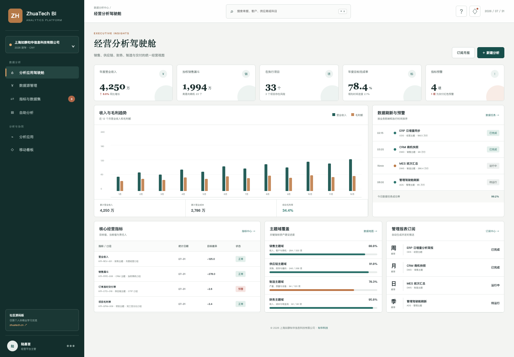
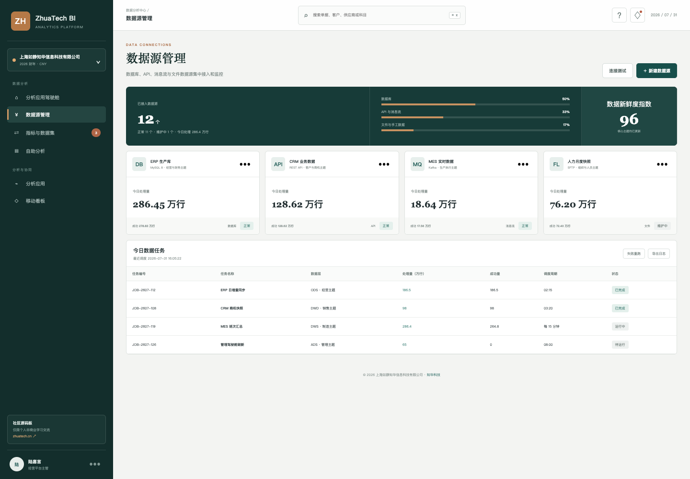
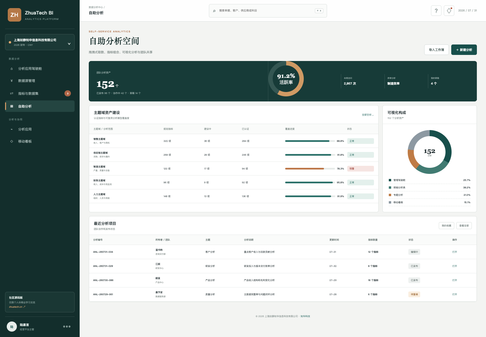

# ZhuaTech BI

### 知华科技商业智能分析平台 · 社区源码版

> 数据不是报表的终点。统一口径、看见变化、找到原因、推动行动，才是经营分析的价值。

**ZhuaTech BI** 是知华科技（上海如静知华信息科技有限公司）公开的企业商业智能项目，展示从数据源接入、数据任务、指标资产到自助分析和移动看板的基本闭环。官方网站：[https://www.zhuatech.cn/](https://www.zhuatech.cn/)。

## 一屏看经营



驾驶舱融合营业收入、销售漏斗、项目交付、目标进度、数据预警、趋势分析和主题域建设进度，所有演示指标均带有口径与责任人信息。

## 数据入口可管理



数据库、API、消息流和文件数据源在同一页呈现连接状态、处理量、成功量、调度周期和数据新鲜度。

## 分析人员自己完成取数



自助空间展示主题域、认证指标、分析资产、协作状态和可视化构成，为继续开发拖拽式分析器和图表编辑器预留结构。

## 产品组成

| 层次 | 社区版能力 |
| --- | --- |
| 数据连接 | MySQL、REST API、消息流、文件等连接示例 |
| 数据任务 | 调度记录、处理量、成功量、运行状态 |
| 指标中心 | 指标编码、统计口径、目标、当前值、责任人 |
| 主题域 | 销售、供应链、制造、财务、人力示例 |
| 分析应用 | 管理驾驶舱、自助分析、订阅和移动看板 |
| 工程能力 | 登录认证、权限基础、MySQL、Flyway、Docker、CI |

## 技术结构

```text
Vue 3 管理端 / H5 看板
          ↓ REST API
Spring Boot 4 · Security · JPA
          ↓
MySQL 8 · Flyway
```

工程包名为 `cn.zhuatech.bi`，数据库名为 `zhuatech_bi`，业务 API 前缀为 `/api/bi`。

## 立即运行演示

```bash
cd frontend
npm install
npm run dev:demo
```

打开 `http://localhost:5173`，使用 `admin / admin123`。如果需要后端和数据库，在根目录复制 `.env.example`、替换所有示例密钥后执行 `docker compose up --build`。

## 安全提醒

演示数据均为虚构。生产环境必须完成密钥轮换、HTTPS、细粒度数据权限、行列权限、下载水印、审计日志、数据脱敏、备份恢复、监控告警和容量评估。

## 个人学习许可

本工程仅可用于个人非商业学习、研究和交流，**不得商用**。企业内部使用、客户交付、SaaS、生产部署、投标、咨询或收费培训须获得上海如静知华信息科技有限公司书面授权，详见 [LICENSE](LICENSE)。

## 找知华科技做深度开发

需要数据中台、指标体系、经营驾驶舱、BI 私有化部署或商业授权，可访问 [知华科技官网](https://www.zhuatech.cn/) 或扫码联系：

| 微信咨询 | 微信咨询 |
| :---: | :---: |
|  |  |

关键词：BI 开源、商业智能源码、经营驾驶舱、数据可视化平台、自助分析、指标管理、Java BI、Vue BI、知华科技、上海如静知华信息科技有限公司。
